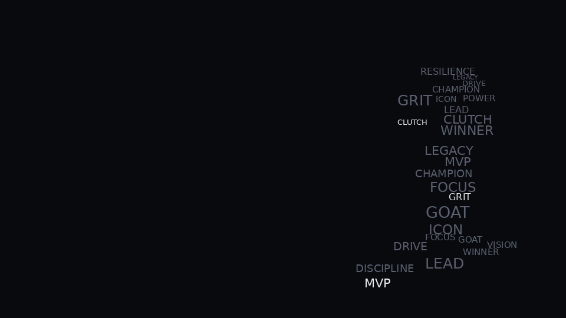
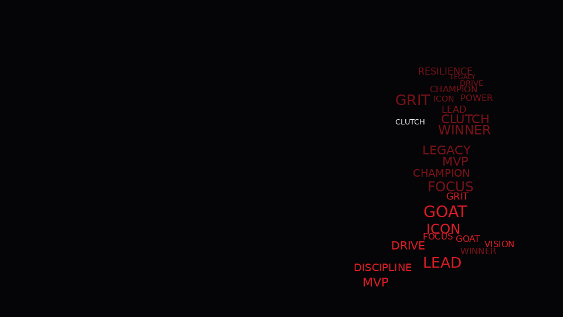
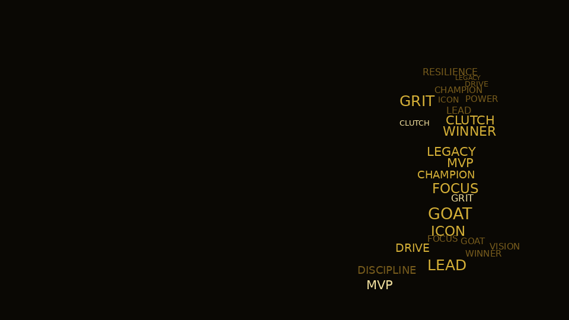
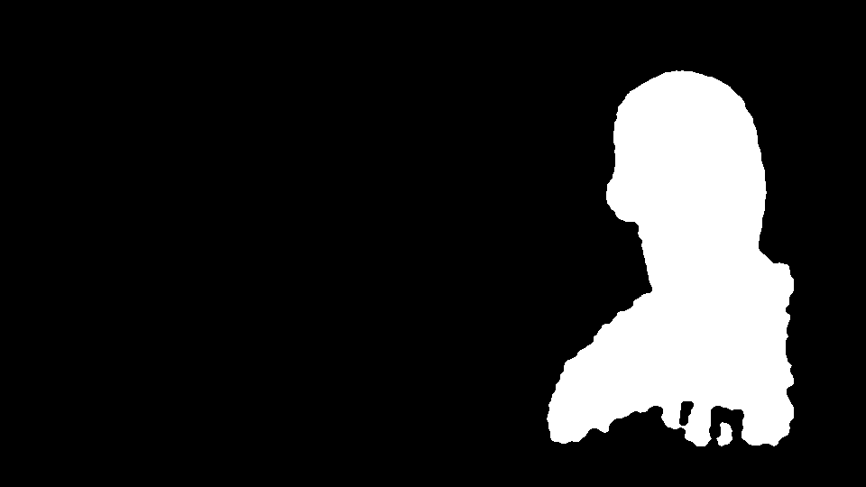

# GlyphForge

GlyphForge is a local-first typographic portrait generator with optional GPU
hooks/metrics for segmentation and future stylization work.

It turns a portrait into export-quality poster or wallpaper artwork built from
real, readable words placed inside a subject silhouette.

## Why this project
- Python-first CV + rendering pipeline (not a thin image-gen wrapper)
- Real text placement with mask-awareness and collision control
- Local Gradio app with deterministic seed and high-res PNG export

## Code Organization
- `glyphforge/` is the reusable core engine (image processing, typography layout, rendering).
- `studies/jordan_wallpaper/` is the intentionally overfit reference-recreation study.
- `scripts/recreate_reference_wallpaper.py` is a thin wrapper around the study pipeline.
- `experiments/` documents failures, tradeoffs, and iteration notes.

## Demo Gallery

### Monochrome Dark


### Sports Red/Black


### Gold/Black Tribute


### Segmentation/Mask Preview


## MVP features
- Upload portrait
- Parse words (comma/newline separated)
- Live stage previews in Gradio:
  - preprocessed portrait
  - subject mask
  - final typographic output
  - metrics JSON
- Theme selection:
  - monochrome dark
  - minimal grayscale
  - sports red/black
  - gold/black tribute
- Mask generation with fallback if segmentation model is unavailable
- Typography layout engine:
  - weighted word priority
  - varied font sizes
  - occupancy-grid collision avoidance
  - grayscale/edge-guided placement bias
  - deterministic seed option
- Export presets: `1:1`, `4:5`, `16:9`, `9:16`

## Architecture
Pipeline summary:
1. Preprocess portrait to target ratio and resolution.
2. Generate subject mask with segmentation fallback chain.
3. Build importance map from mask + grayscale darkness + edge strength.
4. Parse and weight words by priority.
5. Place text using importance-guided sampling and occupancy-grid collision checks.
6. Render themed output and export PNG.

See [docs/algorithm.md](docs/algorithm.md) for the full algorithm details.

## Local Setup (`uv`)
Create a dedicated environment named `inferenceimg`:

```bash
uv venv inferenceimg
source inferenceimg/bin/activate
uv pip install -r requirements.txt
```

## Run Gradio

```bash
python app.py
```

Gradio output panels include:
- preprocessed portrait preview
- subject mask preview
- final typographic output
- metrics JSON

## Run CLI

```bash
python cli.py \
  --input reference_img/Michael-Jordan-Wallpaper-Desktop-1.jpg \
  --words "MVP, Champion, Leader, Legacy, Focus, Discipline" \
  --theme sports_red_black \
  --ratio 16:9 \
  --output examples/outputs/sample.png
```

## Test

```bash
pytest -q
```

## Limitations
Current constraints are documented in [docs/limitations.md](docs/limitations.md).

## GPU Roadmap
Planned GPU evolution is documented in [docs/gpu-roadmap.md](docs/gpu-roadmap.md).

## Roadmap
General roadmap: [docs/roadmap.md](docs/roadmap.md)
