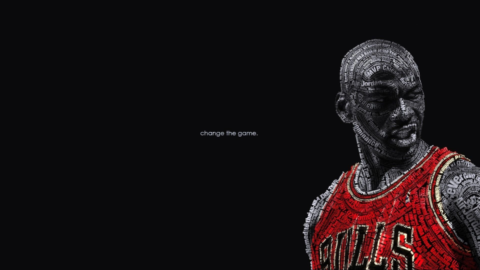
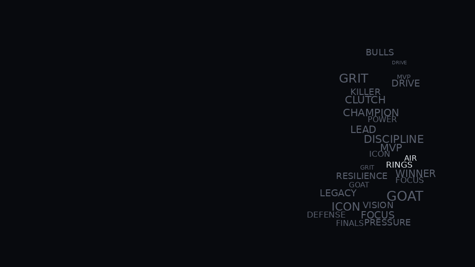
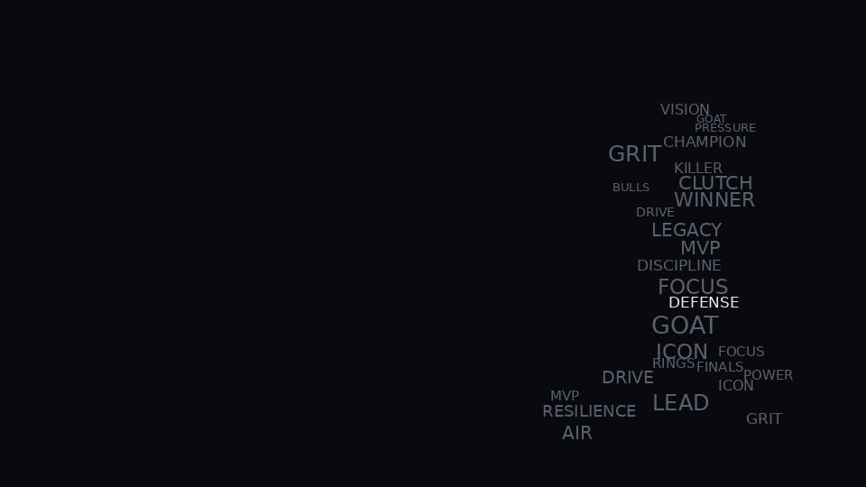
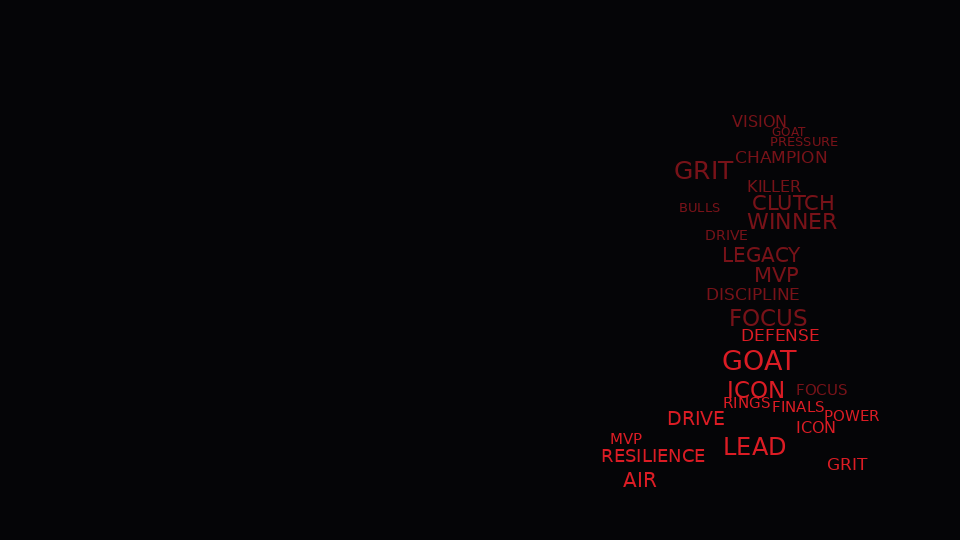

# GlyphForge

GlyphForge is an experimental Python renderer for typographic portrait posters.
The current target is simple: take a portrait, extract a subject silhouette, and
pack real readable words into that shape without turning the result into a
generic word cloud.

This is not finished, and it is not pretending to be. The useful part of the
repo is the renderer iteration: mask quality, text placement, density
tradeoffs, and how much portrait structure survives after words replace tone.

## Current status

This is an experimental renderer, not a finished design tool. The current goal
is to recreate the visual logic behind typographic sports portraits: readable
text, subject masks, shadow-aware placement, and region-specific styling. The
output is improving, but it is still far from the reference-grade poster style.

## What It Does Right Now

- Local Gradio app: `python app.py`
- Local CLI: `python cli.py`
- Portrait preprocessing and crop-to-ratio
- Segmentation fallback chain
- Mask cleanup with morphology
- Weighted word parsing
- Occupancy-grid collision checks
- Importance-guided sampling using:
  - subject mask
  - grayscale darkness
  - edge magnitude
- PNG export

## Why I Built It

I wanted a project that sits closer to computer vision, image processing, and
rendering than generic app scaffolding. The visual target is typographic sports
posters where the text density still preserves the face and jersey.

The first version failed in the predictable way: it looked like a word cloud
inside a silhouette. The current version is better because placement is biased
by darkness and edge structure, but it still needs region-aware typography to
feel intentional.

## Demo Outputs

### Current themed outputs


### Evolution artifacts

- Original crop:
  - 
- Subject mask:
  - 
- Uniform sampling failure:
  - 
- Importance-guided improvement:
  - 
- Sports-style reference attempt:
  - 

## What I Learned

The important shift was realizing that "words inside a mask" is not enough.
That approach fills space, but it does not preserve portrait structure. The
current renderer improves on that by sampling from an importance map:

`importance = subject_mask * (darkness + edge_strength)`

That helps, but it still is not enough for high-quality likeness. The next
problem is not more density. It is smarter placement:

- face-aware protected regions
- different logic for face vs jersey
- rotated or region-oriented text
- better handling for anchor words and long phrases

## Run It Locally

Create the local environment:

```bash
uv venv inferenceimg
source inferenceimg/bin/activate
uv pip install -r requirements.txt
```

Start Gradio:

```bash
python app.py
```

Run the CLI:

```bash
python cli.py \
  --input reference_img/Michael-Jordan-Wallpaper-Desktop-1.jpg \
  --words "MVP, GOAT, ICON, GRIT, FOCUS, DRIVE" \
  --theme sports_red_black \
  --ratio 16:9 \
  --output examples/outputs/sample.png
```

Run tests:

```bash
pytest -q
```

## Repo Sections Worth Reading

- Algorithm notes:
  - [docs/algorithm.md](docs/algorithm.md)
- Known limitations:
  - [docs/limitations.md](docs/limitations.md)
- GPU roadmap:
  - [docs/gpu-roadmap.md](docs/gpu-roadmap.md)
- Experiment logs:
  - [experiments/001_uniform_sampling_vs_importance_sampling.md](experiments/001_uniform_sampling_vs_importance_sampling.md)
  - [experiments/002_mask_failures.md](experiments/002_mask_failures.md)
  - [experiments/003_reference_recreation_attempt.md](experiments/003_reference_recreation_attempt.md)
  - [experiments/004_text_density_tradeoff.md](experiments/004_text_density_tradeoff.md)

## Current Limitations

- Text is axis-aligned only.
- Output quality depends heavily on mask quality.
- There is no explicit face landmark preservation yet.
- PNG export is raster output, not vector typography.
- Longer phrases still hurt packing efficiency fast.

## Short Version

This repo is best read as a rendering notebook with a working app around it,
not as a finished product page. The interesting part is the algorithmic
improvement path, not the current polish level.
